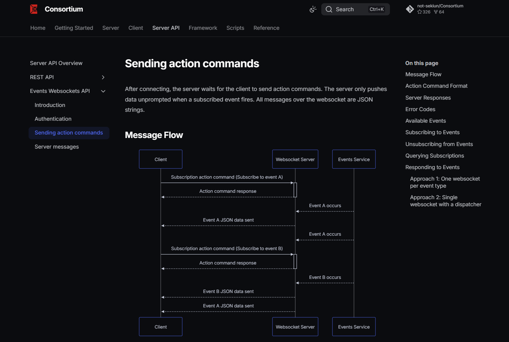

<br>
<p align="center">
  <picture>
    <source media="(prefers-color-scheme: dark)" width="75%" srcset="docs/assets/banner_dark_mode.png">
    <source media="(prefers-color-scheme: light)" width="75%" srcset="docs/assets/banner_light_mode.png">
    
  </picture>
</p>


<br>

<p align="center"><b>A modern C2 framework with a focus on extensibility</b></p>

<p align="center">
  
  
  <a href="https://not-sekiun.github.io/Consortium/">
    
  </a>
  <im src="https://img.shields.io/github/commit-activity/m/not-sekiun/Consortium">
  <a href="https://discord.com/users/395192115996655627">
    
  </a>
</p>

Consortium is a <i>programming language agnostic</i>, and
<i>networking protocol agnostic</i> command and control (C2) framework that is
designed to be <i>collaborative</i>, <i>highly extensible</i>, and <i>modular</i>.
The framework ships with its own listeners and agents while also allowing users to
rapidly develop their own highly customized listeners and agents.

> [!CAUTION]
> Consortium is **actively being developed** and is currently considered to be in the
> _alpha phase_ of development. As such it should be noted that:
>
> 1. Backwards incompatible/breaking changes may be made at any time.
> 2. The framework is currently not considered to be feature-complete.
> 3. Documentation will be lacking and incomplete.
>
> Feel free to raise any problems, feature requests, or bug reports in the GitHub
> issues section.

## Features

- **Asynchronous multiplayer/multiserver support**: Multiple clients can connect to
  the same server to perform all C2 related operations, including the sharing of agent
  sessions. Control RBAC permissions via user roles.
- **High extensibility and automation, externally and natively**: Programmatic
  automation is possible through the server's **REST API** or **websockets events API**.
  Alternatively, users can write **plugins** and **event hooks** that interact
  _directly_
  with the server's internal services.
- **Language-agnostic modular listener-agent design**: Consortium ships with its own
  listeners and agents. **Custom listeners and agents** can be added to the framework.
  Agents can be written in any language while listeners can be written in python to
  _natively interact with the server_, or written in a different language to interact
  with the server _through its REST API_.

## Getting Started

### Prerequisites

Consortium requires Python 3.14+ and uses the uv package manager to handle its
dependencies. Git is recommended for installing and updating the framework.

1. [Install Python 3.14+](https://www.python.org/downloads)
2. [Install uv](https://docs.astral.sh/uv/getting-started/installation/)
3. [Install Git](https://www.git-scm.com)

> [!IMPORTANT]
> Make sure your installed tools are visible on your system PATH.

### Installation

Clone the repository and install dependencies.

```bash
git clone https://github.com/not-sekiun/Consortium.git
cd Consortium
uv sync --group components
```

### Quick Start

The Consortium C2 framework runs on a client-server model. Start the server _first_
before starting any compatible client to connect to the server.

Start the Consortium server. By default, it binds to `0.0.0.0:9999`.

```bash
uv run consortium.py server
```

Afterwards, start the Consortium client. By default, it connects to `127.0.0.1:9999`

```bash
uv run consortium.py client
```

### Updating

Pull the latest changes from the repository and update/install any new dependencies.

```shell
git pull
uv sync --group components
```

## Documentation

### Complete Framework Documentation and Self-Hosted Documentation

> [!WARNING]
> The current documentation page is still heavily a WIP and is largely incomplete.

Complete documentation is available at the
[official Consortium documentation site](https://not-sekiun.github.io/Consortium/).

Alternatively, you can install dependencies to host and view the documentation locally.
From the project root folder, run:

```shell
uv sync --group docs
uv run zensical serve
```

### Server REST API Documentation

> [!Note]
> The REST API documentation is only accessible to the local host.

Automatically generated REST API endpoint documentation is available at `/doc` and
`/redoc` from the server's root URL.

Start the server first.

```shell
uv run consortium.py server
```

Then open a web browser to either URL.

#### REST API documentation at /docs (http://localhost:9999/docs by default)


#### REST API documentation at /redoc (http://localhost:9999/redoc by default)


### Server Events Websocket API Documentation

The Consortium server provides a WebSocket Events API for server-initiated push events.
Complete documentation is located at the
[official Consortium documentation site](https://not-sekiun.github.io/Consortium/)



Alternatively, to host and view this documentation locally, refer back to
[this section](#complete-framework-documentation-and-self-hosted-documentation)

### Client Documentation

There are several ways to get help information and command documentation within the
client.

1. General help menu: To view all commands for a particular interpreter in the client
   type `help`.
2. Command summary: To view the summary for a specific command, which includes all of
   its arguments, type `help <command>`.
3. Command help: To get comprehensive help for a specific command, including examples on
   how to use it, type `<command> --help` or `<command> -h`.

<br>


## Contributing

I am currently not accepting any code contributions to the Consortium framework, the
current code base is too unstable. However, I am accepting feature requests, bug
reports, and other issues through the GitHub issues section.

## Credits

This project makes heavy use of the following libraries and frameworks.

- [FastAPI](https://github.com/fastapi/fastapi) for the REST API and websockets server.
- [Prompt-toolkit](https://github.com/prompt-toolkit/python-prompt-toolkit) for the
  client CLI interface.
- [Rich](https://github.com/Textualize/rich) for modernizing and beautifying displays in
  the terminal
- [Websockets](https://github.com/python-websockets/websockets) for the event based
  communication for the client.

Many other pre-existing C2 frameworks provided the inspiration and motivation to create
this one.

- [Empire, formerly Powershell-Empire](https://github.com/BC-SECURITY/Empire) for some
  of the client design and UI
- [Mythic](https://github.com/its-a-feature/Mythic) for some elements of the framework
  design
- [Cobalt Strike](https://www.cobaltstrike.com/) for the functionality and design of the
  listeners and agents
