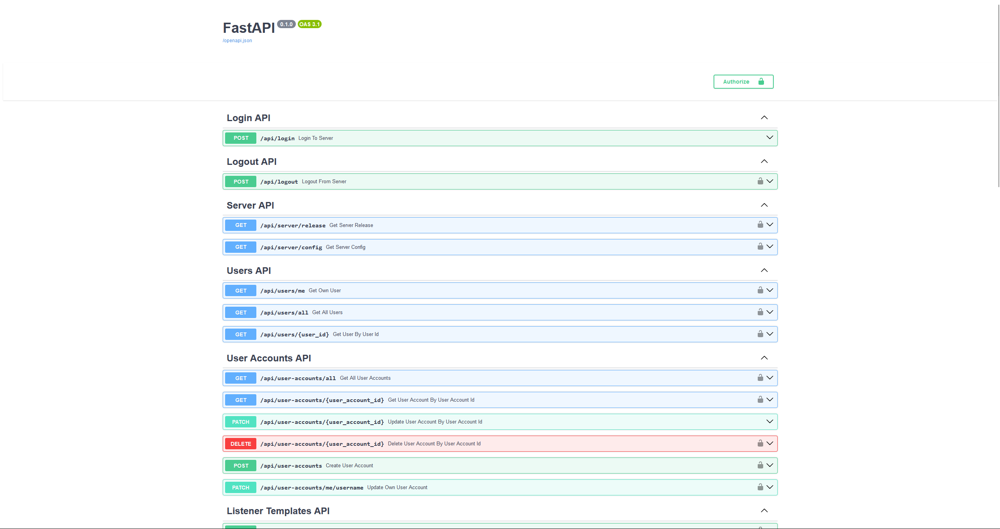
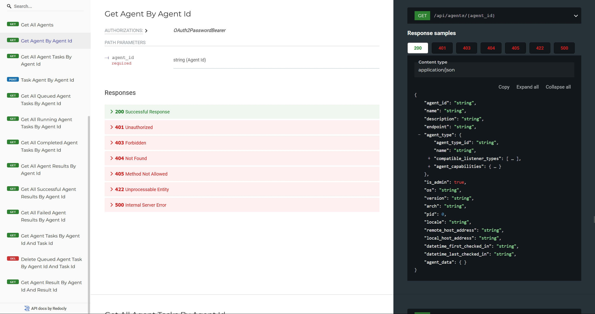
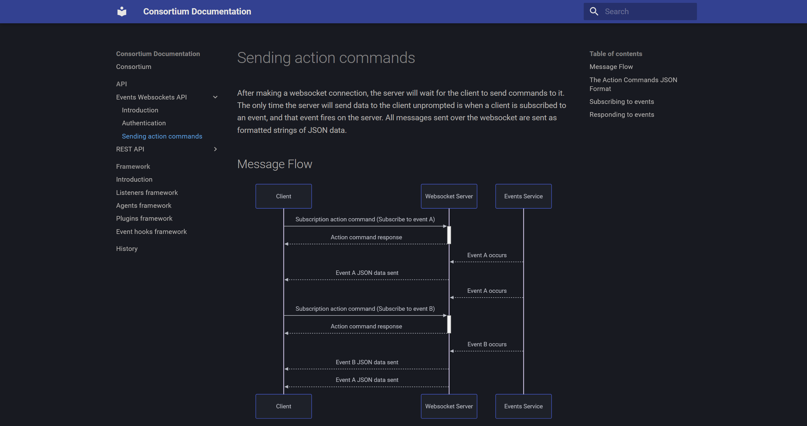

<p align="center">
  
</p>

<p align="center"><b>Modern C2 framework with a focus on extensibility</b></p>

<p align="center">
  
  
  <a href="https://not-sekiun.github.io/Consortium/">
    
  </a>
  <a href="https://discord.com/users/395192115996655627">
    
  </a>
</p>

# Consortium

Consortium is a _programming language agnostic_, and _networking protocol agnostic_
command and control (C2) framework that is designed to be _collaborative_,
_highly extensible_, and _modular_. The framework ships with its own listeners and
agents while also allowing users to rapidly develop their own highly customized
listeners and agents.


> [!CAUTION]
> Consortium is **actively being developed** and is currently considered to be in the
> _alpha phase_ of development. As such it should be noted that:
>
> 1. Backwards incompatible/breaking changes may be made at any time.
> 2. The framework is currently not considered to be feature-complete.
> 3. Documentation will be lacking and incomplete.
>
> Feel free to raise any problems, feature requests, or bug reports in the GitHub
> issues section.

## Features

- **Asynchronous multiplayer/multiserver support** - Multiple clients can connect to
the same server to perform all C2 related operations, including the sharing of agent
sessions. Control RBAC permissions via user roles.
- **High extensibility and automation, externally and natively** - Programmatic
automation is possible through the server's **REST API** or **websockets events API**.
Alternatively, users can write **plugins** and **event hooks** that interact _directly_ with
the server's internal services.
- **Language-agnostic modular listener-agent design** - Consortium ships with its own listeners and
agents. **Custom listeners and agents** can be added to the framework. Agents can
be written in any language while listeners can be written in python to _natively
interact with the server_, or written in a different language to interact with the
server _through its REST API_.

## Quickstart

### Prerequisites

Consortium requires Python 3.14+ and uses the uv package manager to handle its
dependencies. Git is recommended for installing and updating the framework, no
binary releases will be provided.
1. [Install Python 3.14+](https://www.python.org/downloads)
2. [Install uv](https://docs.astral.sh/uv/getting-started/installation/)
3. [Install Git](https://www.git-scm.com)

> [!IMPORTANT]
> Make sure your installed tools are visible on your system PATH.

### Installation

1. Clone the Consortium repository with `git` and `cd` into its root folder.
```bash
git clone https://github.com/not-sekiun/Consortium.git
cd Consortium
```

2. Install dependencies through `uv`.
```bash
uv sync
```

### Starting the Framework

The Consortium C2 framework runs on a client-server model. To use the
framework the server must be started before starting any compatible client
to connect to the server.

1. Start the Consortium server. By default, it binds at `0.0.0.0:1337`.
```bash
uv run consortium.py server
```

2. Start the Consortium client. By default, it connects to `127.0.0.1:1337`
```bash
uv run consortium.py client
```

### Updating

1. In the project's root folder, pull the new repository changes with `git`.
```shell
git pull
```

2. Update any dependencies that are present using `poetry`.
```shell
uv sync
```

## Documentation

### Server REST API Documentation

> [!Note]
> The REST API documentation is only accessible to the local host.

The Consortium server is powered by FastAPI, which provides a built-in Swagger UI
for interacting with the server's REST API. The Swagger UI can be accessed by
navigating to `/doc` or `/redoc` at the server's root URL in a web browser.

Start the server first.

```shell
uv run consortium.py server
```

Then open a web browser to the API endpoints.

#### REST API documentation for the /docs endpoint (http://localhost:9999/docs by default)



#### REST API documentation for the /redoc endpoint (http://localhost:9999/redoc by default)



### Server Events Websocket API Documentation

The Consortium server provides a WebSocket API for server-initiated push events. While
this is considered part of its API, it is _not_ documented by FastAPI due to issues
with the OpenAPI specification. As such the WebSocket API is documented at the
Consortium wiki's Events WebSocket API page.



This documentation is hosted locally and included with the repository. To view it
locally, install the documenation dependencies through uv,
`uv sync --group docs` and run it by changing directory into the `docs` folder and
serving the documentation locally.

> [!NOTE]
> The mkdocs page is still heavily a WIP and is largely incomplete. It is included here
> only for completeness.

```shell
cd docs
uv run mkdocs serve
```

### Client Documentation

To view all commands for a particular interpreter in the client type `help`.

```shell
Consortium (Home) > help
                                                                         Help Menu
┏━━━━━━━━━━━━━━━━━━━━━━━━━━━┳━━━━━━━━━━━━━━━━━━━━━━━━━━━━━━━━━━━━━━━━━━━━━━━━━━━━━━━━━━━━━━━━━━━━━━━━━━━━━━━━━━━━━━━━━━━━━━━━━━━━━━━━━━━━━━━━━━━━━━━━━━━━━━┓
┃ Command                   ┃ Description                                                                                                                  ┃
┡━━━━━━━━━━━━━━━━━━━━━━━━━━━╇━━━━━━━━━━━━━━━━━━━━━━━━━━━━━━━━━━━━━━━━━━━━━━━━━━━━━━━━━━━━━━━━━━━━━━━━━━━━━━━━━━━━━━━━━━━━━━━━━━━━━━━━━━━━━━━━━━━━━━━━━━━━━━┩
│ agents                    │ Switch to the agents interpreter, the interface for managing and controlling connected agents.                               │
│ banner                    │ Display a banner with information and branding about the Consortium framework.                                               │
│ clear                     │ Clear the terminal screen.                                                                                                   │
│ connect                   │ Create a new client session to a Consortium server using a configuration file or by manually specifying connection details.  │
│ disconnect                │ Disconnect the current client session or a specific client session from a Consortium server                                  │
│ exit                      │ Close the Consortium client and exit the program.                                                                            │
│ generators                │ Switch to the generators interpreter, the interface for creating and managing the generation of agent payloads.              │
│ help                      │ Display the help summary of a specific command or display the help menu listing all available commands for the current       │
│                           │ interpreter.                                                                                                                 │
│ home                      │ Return to the home interpreter, the main control interface of the Consortium framework.                                      │
│ info_client_session       │ Display detailed information for the current client session or for a specific client session.                                │
│ interact_client_session   │ Choose a specific client session to interact with that is associated with a specific user account logged into a specific     │
│                           │ Consortium server.                                                                                                           │
│ list_client_sessions      │ List basic information for all current client sessions to a Consortium server.                                               │
│ listeners                 │ Switch to the listeners interpreter, the interface for creating and managing listeners.                                      │
│ redescribe_client_session │ Change the description of the current client session or a specific client session.                                           │
│ rename_client_session     │ Rename the current client session or a specific client session.                                                              │
└───────────────────────────┴──────────────────────────────────────────────────────────────────────────────────────────────────────────────────────────────┘
```

To view the summary for a specific command, which includes all of its arguments, type
`help <command>`.

```shell
Consortium (Home) > help connect
description: Create a new client connection to a Consortium server using a configuration file or by manually specifying connection details.
usage: connect [-h] [-c [CONFIG_FILEPATH]] [-rh HOSTNAME/IP] [-rp PORT] [-u USERNAME] [-p PASSWORD]
```

To get the most comprehensive help for a specific command, including examples on how to
use that particular command, type `<command> --help` or
`<command> -h`.

> [!Note]
> The portion of the example behind the `#` is a comment that is not part of the
> command.

```shell
Consortium (Home) > connect --help
usage: connect [-h] [-c [CONFIG_FILEPATH]] [-rh HOSTNAME/IP] [-rp PORT] [-u USERNAME] [-p PASSWORD]

Create a new client session to a Consortium server using a configuration file or by manually specifying connection details.

options:
  -h, --help            show this help message and exit
  -c [CONFIG_FILEPATH], --config [CONFIG_FILEPATH]
                        The filepath to a configuration JSON file containing the client settings specifying the remote host, remote port, username, and
                        password to use when connecting to the Consortium server. If not provided, the default filepath to the configuration file is used.
  -rh HOSTNAME/IP, --remote-host HOSTNAME/IP
                        The remote hostname or IP address of the Consortium server to connect to.
  -rp PORT, --remote-port PORT
                        The port of the Consortium server to connect to.
  -u USERNAME, --username USERNAME
                        The username of the account to login to when connecting to the Consortium server.
  -p PASSWORD, --password PASSWORD
                        The password of the account to login to when connecting to the Consortium server.

Examples:
  connect -c  # Connect using the default filepath to the client configuration file.
  connect -c path/to/client_config.json  # Connect using a custom configuration file.
  connect -u username -p password -rh server.com -rp 1234  # Connect through manually provided connection details.

```

### Complete Framework Documentation (WIP)

Complete documentation is available at the [Consortium wiki](https://github.com/not-sekiun/Consortium).
Alternatively, you can install dependencies to host and view the documentation locally.
From the project root folder, run:

```shell
uv sync --group docs
uv run mkdocs serve
```

The wiki provides:

1. A detailed guide on using the framework
2. An introduction to the workflow of the framework
3. Explanations of commonly used terms
4. An overview of the infrastructure of the framework

The wiki also covers advanced topics not documented within the application itself,
including:

- Writing custom native listeners, agents, plugins, and event hooks
- Utilizing the WebSocket API for server-initiated push events
- Writing listeners and agents in languages other than Python


## Credits

This project would not have been possible without the existence of the following
excellently written libraries and frameworks.

- [FastAPI](https://github.com/fastapi/fastapi) for the REST API and websockets server.
- [Prompt-toolkit](https://github.com/prompt-toolkit/python-prompt-toolkit) for the
client CLI interface.
- [Rich](https://github.com/Textualize/rich) for modernizing and beautifying displays
in the terminal
- [Websockets](https://github.com/python-websockets/websockets) for the event based
communication for the client.

On top of that many other pre-existing C2 frameworks provided the inspiration and
motivation to create this one.

- [Empire, formerly Powershell-Empire](https://github.com/BC-SECURITY/Empire) for some
of the client design and UI
- [Mythic](https://github.com/its-a-feature/Mythic) for some elements of the framework
design
- [Cobalt Strike](https://www.cobaltstrike.com/) for the functionality and design of
the listeners and agents
