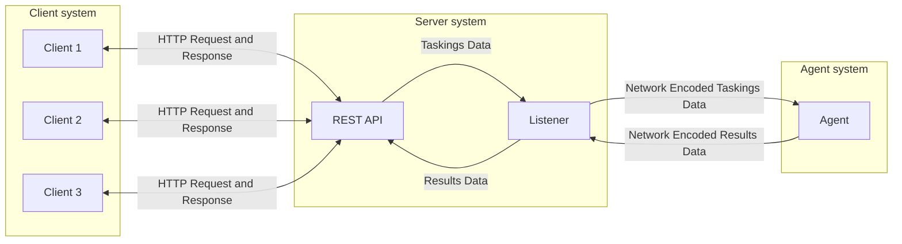

# Introduction

The Consortium framework is a complex system with many moving parts. Additionally,
across the documentation, we use a lot of specific terminology with very particular
meanings. This section serves as an introduction to the overall design of the entire
framework introducing essential concepts required to effectively use the framework.

## Server architecture

Consortium adopts a _server-client architecture_. This means that all C2 related
operations are managed by a central server. Multiple clients can connect to this server
at once to issue various commands related to the management of C2 related operations
such as starting/stopping listeners, issuing tasks to agents, requesting for a file
download, etc.

The four most fundamental components of the Consortium framework are:

1. **Server** - The central server that manages all C2 operations.
2. **Client** - The user that connects to the server to issue commands and receive
results. This is primarily done through the REST API with server pushed events occuring
over the events WebSockets API.
3. **Listener** - The component that allows agents to connect back to the server. The
listener is primarily responsible for translating data from the Consortium framework
into a networking format compatible with the Agent and vice versa.
4. **Agent** - The piece of software that runs on the target machine and connects back
to the server to receive commands, execute them, and send back the results.

??? note "Terminology: Agents vs Clients"
    Although in this model, Agents are technically network clients, the term _client_ in
    particular refers to the user of the framework that is issuing commands to the
    server.

Below is the heavily simplified architecture demonstrating how these components
interact with each other:

