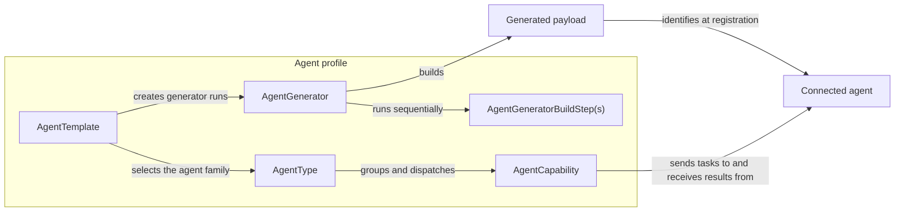

# Agents Overview

An agent profile defines everything the framework needs to generate an agent payload and
handle its commands once deployed. A profile is made up of four cooperating classes that
cover two distinct concerns: how to **build** the agent (the generator and its build
steps), and what the agent can **do** once running (the agent type and its
capabilities).

## Agent profile components

| Class                     | Base                          | Role                                                                                                 |
|---------------------------|-------------------------------|------------------------------------------------------------------------------------------------------|
| `AgentType`               | `BaseAgentType`               | Names the agent family; groups all its executable capabilities                                       |
| `AgentCapability`         | `BaseAgentCapability`         | A single command the agent can execute                                                               |
| `AgentTemplate`           | `BaseAgentTemplate`           | Configuration schema and factory; creates `AgentGenerator` instances                                 |
| `AgentGenerator`          | `BaseAgentGenerator`          | Orchestrates a pipeline of `AgentGeneratorBuildStep` classes to produce the deployable agent payload |
| `AgentGeneratorBuildStep` | `BaseAgentGeneratorBuildStep` | One discrete stage in the build pipeline                                                             |

The template links everything together:

```python
class AgentTemplate(BaseAgentTemplate):
    ...
    agent_generator = AgentGenerator  # class that builds the payload
    agent_type = AgentType  # capabilities the generated agent exposes
    compatible_listener_types = {"tcp_json"}  # listener types it can connect through
```

### How the pieces relate



`AgentTemplate` is the profile's composition point: it defines how to build an agent and
which commands the resulting agent type supports. A generator run produces a payload;
when that payload connects, the framework resolves it to the profile's agent type and
uses that type's capabilities to dispatch tasks.

## How agent and listener profiles are linked

`compatible_listener_types` on the agent template is a set of listener type `name`
strings. The framework uses this set to:

1. Validate that an agent generator can be registered against a given listener type.
2. Resolve which agent types a particular listener type can serve.

```python
# Listener type (from listener profile)
class ListenerType(BaseListenerType):
    name = "tcp_json"


# Agent template (from agent profile) -- links to the listener type by name
class AgentTemplate(BaseAgentTemplate):
    compatible_listener_types = {"tcp_json"}
```

## Project structure

!!! tip "Scaffold it instead"

    Rather than creating these files by hand, you can generate a ready-to-edit agent
    profile (directory, `manifest.json`, and commented `agent_type.py`,
    `agent_generator.py`, and `agent_template.py` files) with the **Create** action of the
    [component manager](../../scripts/manage-components.md) (`manage_components.py`). This
    section is still worth reading to understand what the generated files do.

Each agent profile lives in its own directory under `consortium/components/agents/`:

```
consortium/components/agents/my_agent/
├── manifest.json
├── agent_type.py      (declares capabilities and the AgentType)
├── agent_template.py  (declares the AgentTemplate)
└── agent_generator.py (declares the AgentGenerator and its build steps)
```

`manifest.json` points the loader at the entry class:

```json
{
  "entry_point": "agent_template:AgentTemplate",
  "enabled": true
}
```

The entry point class must be named `AgentTemplate` by convention. Capabilities are
typically declared in the same file as `AgentType` or in a dedicated
`agent_capabilities/` subdirectory.

## Capability dispatch

When an operator tasks an agent with a command, the framework resolves the capability
by matching the task's `command` field against `AgentType.agent_capabilities` (a
name-keyed dict after class definition). The matching `BaseAgentCapability` subclass is
instantiated and its `execute()` method is called. This calls `on_launch()` to prepare
the task message, sends that message to the agent, and then calls `on_execute()` to
await and process the agent's response.

## The generator pipeline

An `AgentGenerator` does not define custom `on_running()` behaviour. Instead it
declares an ordered list of `BaseAgentGeneratorBuildStep` classes. The framework drives
each step in sequence, passing the same `parameters` dict and a shared `environment`
`SimpleNamespace` between all steps. Steps communicate through `self.environment`:

```
AgentGenerator.on_started()
  -> step 1: BuildAgent.build(parameters)   # e.g. write script
  -> step 2: SignPayload.build(parameters)  # e.g. sign the binary
  -> step 3: UploadPayload.build(parameters)
AgentGenerator.on_completed()
```

Each build step calls `self.agent_templates_payload_service` to store build artifacts
for later retrieval via the REST API.

For example, one step can render source and leave it in the shared environment, while a
later step stores that rendered source as the generated payload:

```python
class RenderSource(BaseAgentGeneratorBuildStep):
    name = "Render source"

    async def build(self, parameters: dict) -> None:
        self.environment.rendered_source = (
            f"SERVER = {parameters['remote_host']!r}\n"
            f"PORT = {parameters['remote_port']!r}\n"
        )


class StorePayload(BaseAgentGeneratorBuildStep):
    name = "Store payload"

    async def build(self, parameters: dict) -> None:
        await self.agent_templates_payload_service.create_payload_file(
            build_parameters=parameters,
            content=self.environment.rendered_source,
            name="agent.py",
        )
```

The environment belongs to one generator run, so it is safe for steps in that run to
share state through it. Do not use it for state that should survive a later generator
run; persist that state through the appropriate service instead.

## Real-world examples

`consortium/components/agents/consortium/http/` is the canonical reference
implementation. It demonstrates:

- Multiple `BaseAgentCapability` subclasses, including custom `on_execute()` handlers
- Custom `BaseAgentCapability` subclasses with multi-message `on_execute()` for
  streaming (file download/upload)
- A single-step generator that reads a Python source template, performs string
  replacements for configuration, and outputs a script, oneliner, or PyInstaller
  executable
- `on_started()` on the generator to pre-validate that required tools are present
- `AgentGeneratorStartError` to abort a build before steps execute
