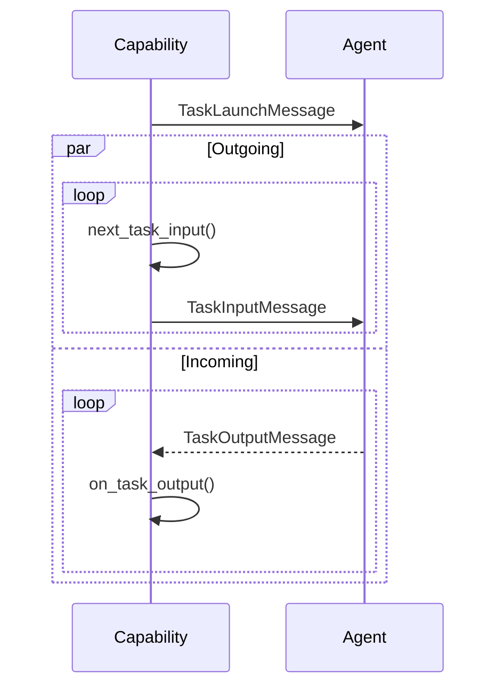

# Bidirectional Stream Capability

## Overview

`BidirectionalStreamCapability` runs the outgoing and incoming sides
**concurrently**, giving the capability a full-duplex channel to the agent:
think of it as a pseudo virtual TTY, where the launch message opens the session,
the outgoing handler is the input channel, and the emitted events are the output
channel.

## Communication Pattern

!!! info "Where this fits in"
    The shared `execute()` method calls `on_launch` (passed through unchanged
    here) and sends the `TaskLaunchMessage` before `on_execute` (shown below)
    takes over.

The two loops run side by side; how they end is what makes this pattern distinct
from the other stream capabilities.

!!! info "Termination: the gRPC half-close model"
    - The **outgoing** loop returning `Finish` is a half-close: it stops sending,
      but the incoming loop keeps running and still owns the task outcome.
    - The **incoming** loop returning `Success`, `Failure`, or `Finish` ends the
      whole exchange (the outgoing loop is cancelled).
    - The **incoming** loop idling out (no message within `idle_timeout`) hands control
      to `on_idle_timeout`: by default it raises, erroring the task so the timeout is
      visible, but it can return `None` to wait again (a receive-retry, never a resend),
      `Finish` to end the exchange cleanly but silently, or a `Success`/`Failure` to
      report an outcome.
    - Either loop **raising** aborts the entire exchange and errors the task.

!!! warning "No fully independent mode"
    Both loops finishing on their own, with neither cancelling the other, is
    deliberately not supported: there's no real use case the half-close doesn't already
    cover. An optional `idle_timeout` on the incoming side bounds how long it waits for
    the next message; `on_idle_timeout` then decides whether to wait again (backing off
    via `attempt`), end cleanly, or report an outcome, so a silent agent need not hang.

## Hooks

| Hook | Returns | Purpose |
|---|---|---|
| `next_task_input()` | `TaskInputMessage | Finish` | Produce the next message to send, or half-close the send side with `Finish`. Never produces the task result itself. |
| `on_task_output(index, task_output_message)` | `Success | Failure | Finish | None` | Consume each message from the agent, typically reporting streamed output via `emit_*` events. `None` keeps receiving; `Success`/`Failure`/`Finish` ends the whole exchange. |
| `resolve_idle_timeout(index, attempt)` | `int | float | None` | Seconds the incoming side waits for the next message before idling out; re-armed per receive attempt. `attempt` is 0 for the first wait, increments per retry, and resets once a message arrives, so a growing value gives backoff. Default: the `idle_timeout` attribute (`None` = wait forever). |
| `on_idle_timeout(index, attempt)` | `Success | Failure | Finish | None` | Called when the incoming side idles out. Raising (the default) errors the task, surfacing the timeout; `None` waits again (retries the receive, re-arming `resolve_idle_timeout`); `Success`/`Failure` ends the exchange with that outcome; `Finish` ends it cleanly (cancelling the send loop) but silently. Never resends. |
| `on_launch(task_launch_message)` | `TaskLaunchMessage` | Passes the launch message through unchanged by default. |

!!! tip
    Because the incoming side always owns the final outcome,
    `next_task_input` returning `Finish` never itself produces a
    `Success`/`Failure`: only the incoming handler (or an exception) can.
