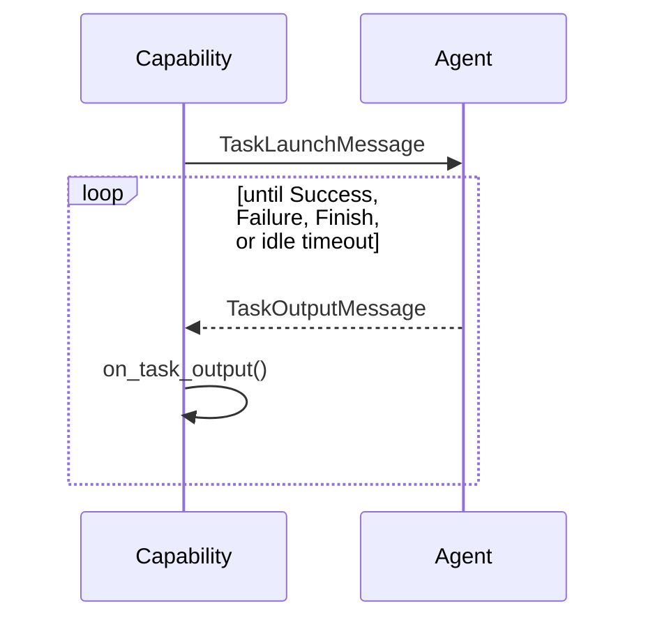

# Incoming Stream Capability

## Overview

`IncomingStreamCapability` is the mirror image of the outgoing stream: it
customizes only the *incoming* side. The `TaskLaunchMessage` is sent as usual,
and then the capability just listens, calling `on_task_output` for
every `TaskOutputMessage` the agent sends back, until one of those calls decides
the exchange is over.

Use this when a capability needs to consume a stream of output from the agent
(e.g. progressively reporting streamed results) but has nothing further to say
after the initial launch.

## Communication Pattern

!!! info "Where this fits in"
    The shared `execute()` method calls `on_launch` (passed through unchanged
    here) and sends the `TaskLaunchMessage` before `on_execute` (shown below)
    takes over.

There's only one path through this capability: the loop keeps receiving until
`on_task_output` says otherwise.

## Hooks

| Hook | Returns | Purpose |
|---|---|---|
| `on_task_output(index, task_output_message)` | `Success | Failure | Finish | None` | Called once per received message. `index` is the 0-based count of messages received so far. `None` keeps listening; `Success`/`Failure` ends the exchange with that outcome; `Finish` ends it with no outcome. |
| `resolve_idle_timeout(index, attempt)` | `int | float | None` | Seconds to wait for the next response before the stream is treated as idle; re-armed per receive attempt. `attempt` is 0 for the first wait, increments per retry, and resets once a response arrives, so a growing value gives backoff. Default: the `idle_timeout` attribute (`None` = wait forever). |
| `on_idle_timeout(index, attempt)` | `Success | Failure | Finish | None` | Called when no response arrives within the idle deadline. Raising (the default) errors the task, surfacing the timeout; `None` waits again (retries the receive, re-arming `resolve_idle_timeout`); `Success`/`Failure` ends the stream with that outcome; `Finish` ends it cleanly but silently. Never resends. |
| `on_launch(task_launch_message)` | `TaskLaunchMessage` | Passes the launch message through unchanged by default; override to inspect or mutate it before it's sent. |

!!! note "Optional idle deadline"
    By default the loop waits indefinitely for each response. Set `idle_timeout` (or
    override `resolve_idle_timeout`) to bound the gap between responses. When it
    elapses, `on_idle_timeout` decides; by default it raises, erroring the task so the
    timeout is visible in the event summary. Override it to wait again (return `None`,
    with `attempt` driving backoff through `resolve_idle_timeout`), end the stream
    cleanly but silently (return `Finish`), or report a `Success`/`Failure`. Retrying
    only ever re-waits; the framework never resends on your behalf.

!!! note "No outgoing side"
    After the launch message, this capability never sends anything else. If it
    needs to send follow-up input too, use
    [Bidirectional Stream Capability](bidirectional-stream-capability.md) or
    [Lock-Step Stream Capability](lock-step-stream-capability.md)
    instead.
