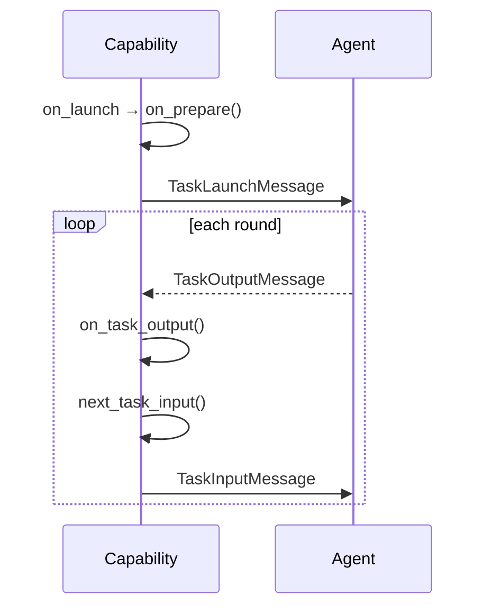

# Lock-Step Stream Capability

## Overview

`LockStepStreamCapability` is the turn-based member of the stream family: it
streams input and output in lock step, one round at a time, following a
`Launch (Input Output)*` protocol. The `TaskLaunchMessage` is a one-off prologue
(prepared by `on_prepare`, sent once, and never re-entering the loop). Every
message after that is a `TaskInputMessage` built from the response that preceded
it, via `next_task_input`.

Rounds are numbered by the exchange they belong to: round 0 is the response to
the launch message, round *n* (n >= 1) is the response to the *n*-th input
message.

## Communication Pattern

!!! info "Where this fits in"
    The shared `execute()` method calls `on_launch` (which resolves the
    iterations cap and calls `on_prepare`) and sends whatever
    `TaskLaunchMessage` comes back, before `on_execute` (shown below) takes over.

This is the idiomatic path: keep receiving a response, building the next input
from it, and sending that, round after round. A few things end or interrupt this
loop:

!!! note "Ending the loop"
    `on_task_output(index, task_output_message)` decides what happens after each
    round:

    - `None`: continue (the response feeds `next_task_input`)
    - `Success` / `Failure`: stop and report that outcome
    - `Finish`: stop with no outcome

    If none of those trigger and the `iterations` cap is reached first, the loop
    stops on its own and reports the **last received response** as the outcome,
    with no explicit `Finish` needed.

!!! note "Timeouts extend patience, they never resend"
    When a round's response does not arrive in time,
    `on_timeout(index, current_task_message, attempt)` decides what happens:

    - Raising (the default) errors the task, so the timeout is visible in the task's
      event summary.
    - `None` waits again for **this same round's** response. This retries only the
      receive: the framework never resends and never advances the round, so the
      strict input/output pairing that defines lock step stays intact.
      `resolve_timeout` is re-armed with an incremented `attempt`, so a growing value
      there gives progressive backoff.
    - A `Success`/`Failure` stops the loop and reports that outcome.
    - `Finish` ends the loop cleanly with no outcome. Note this is silent: the task
      completes with no timeout signal.

    There is deliberately no "skip this round" option: advancing to the next input
    needs a response to build it from, and skipping ahead would duplicate or desync
    the exchange. When a response is missing you can only keep waiting or stop.

!!! warning "Denying the launch"
    To deny a launch, raise `AgentCapabilityLaunchError` from
    `on_prepare`. `on_launch` enforces this: if `on_prepare`
    returns anything that isn't a `TaskLaunchMessage` (such as `None`), the
    launch is rejected and `AgentCapabilityLaunchError` is raised. Either way the
    task ends up **errored**, not skipped.

## Hooks

| Hook | Returns | Purpose |
|---|---|---|
| `resolve_iterations(task_launch_message)` | `int | None` | Max number of input messages to send after the launch. `0` = launch-only request-response; `None` = loop until `on_task_output` stops it. |
| `resolve_timeout(index, current_task_message, attempt)` | `int | float | None` | Seconds to wait for the current round's response. Re-armed per receive attempt: `attempt` is 0 for the first wait, increments per retry, and resets each new round, so a growing value gives backoff. |
| `on_prepare(task_launch_message)` | `TaskLaunchMessage` | Inspect or mutate the one-off launch message. Raise `AgentCapabilityLaunchError` to deny the launch (see warning above). |
| `next_task_input(index, task_output_message)` | `TaskInputMessage` | Build the next input message from the previous round's response. The core hook of the loop; never called for the launch. |
| `on_task_output(index, task_output_message)` | `Success | Failure | Finish | None` | Decide whether to continue. Default stops immediately, reporting the first response. |
| `on_timeout(index, current_task_message, attempt)` | `Success | Failure | Finish | None` | What to do when a round's response times out. Raising (the default) errors the task, surfacing the timeout; `None` waits again for the same round (retries the receive, re-arming `resolve_timeout`, never advancing the round); `Success`/`Failure` stops and reports it; `Finish` ends cleanly but silently. Never resends. |
| `on_completed(index, outcome, stopped_early)` | `None` | Observe the final result before it's returned. Called on every normal termination; **not** called when a hook ends the loop by raising. |

!!! tip
    `index` semantics: round 0 is always the response to the launch message, and
    it only increments when the loop actually continues; `stopped_early` is `False`
    only when the loop ends by exhausting the `iterations` cap.
