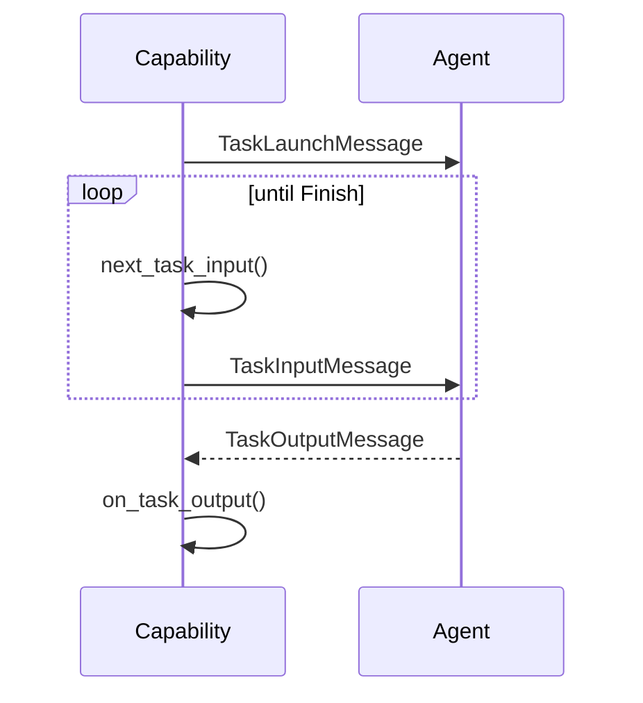

# Outgoing Stream Capability

## Overview

`OutgoingStreamCapability` customizes only the *outgoing* side of the exchange:
it repeatedly asks the capability for the next message to send, without handing
individual agent responses back to the capability while it's sending. Once the
capability signals it's done sending, exactly one final `TaskOutputMessage` is
awaited and passed to `on_task_output`.

Use this when a capability needs to drive a multi-message input stream (e.g.
issuing a sequence of commands) but only cares about a single, final reply.

## Communication Pattern

!!! info "Where this fits in"
    The shared `execute()` method calls `on_launch` (passed through unchanged
    here) and sends the `TaskLaunchMessage` before `on_execute` (shown below)
    takes over.

This is the idiomatic path: send a stream of inputs, half-close with `Finish`,
then process the one final response.

!!! note "Short-circuiting early"
    `next_task_input()` can return a `Success`/`Failure` instead of a
    message at any point. That ends the task immediately with that outcome: the
    loop stops and **no `TaskOutputMessage` is ever received**.

## Hooks

| Hook | Returns | Purpose |
|---|---|---|
| `next_task_input()` | `TaskInputMessage | Success | Failure | Finish` | Produce the next thing to send. A message keeps the loop going; `Finish` half-closes (stop sending, then await the final response); `Success`/`Failure` short-circuits immediately, skipping the final receive. |
| `on_task_output(task_output_message)` | `Success | Failure | None` | Called once, after `Finish`, with the single response received from the agent. Default: `task_output_message.to_outcome()`. |
| `resolve_idle_timeout(attempt)` | `int | float | None` | Seconds to wait for the single final response before giving up; re-armed per receive attempt. `attempt` is 0 for the first wait and increments per retry, so a growing value gives backoff. Default: the `idle_timeout` attribute (`None` = wait forever). |
| `on_idle_timeout(attempt)` | `Success | Failure | Finish | None` | Called if the final response never arrives within the idle deadline. Raising (the default) errors the task, surfacing the timeout; `None` waits again (retries the receive, re-arming `resolve_idle_timeout`); `Success`/`Failure` ends with that outcome; `Finish` ends cleanly but silently. Never resends. |
| `on_launch(task_launch_message)` | `TaskLaunchMessage` | Passes the launch message through unchanged by default. |

!!! warning "`Finish` and type annotations"
    `Finish` is a plain `object()` sentinel (see `control_models.py`), so it
    can't appear in `next_task_input`'s return type annotation until
    [PEP 661](https://peps.python.org/pep-0661/) first-class sentinels land in
    Python 3.15: the annotation only shows `TaskInputMessage | Success | Failure`
    even though `Finish` is a valid return value.
