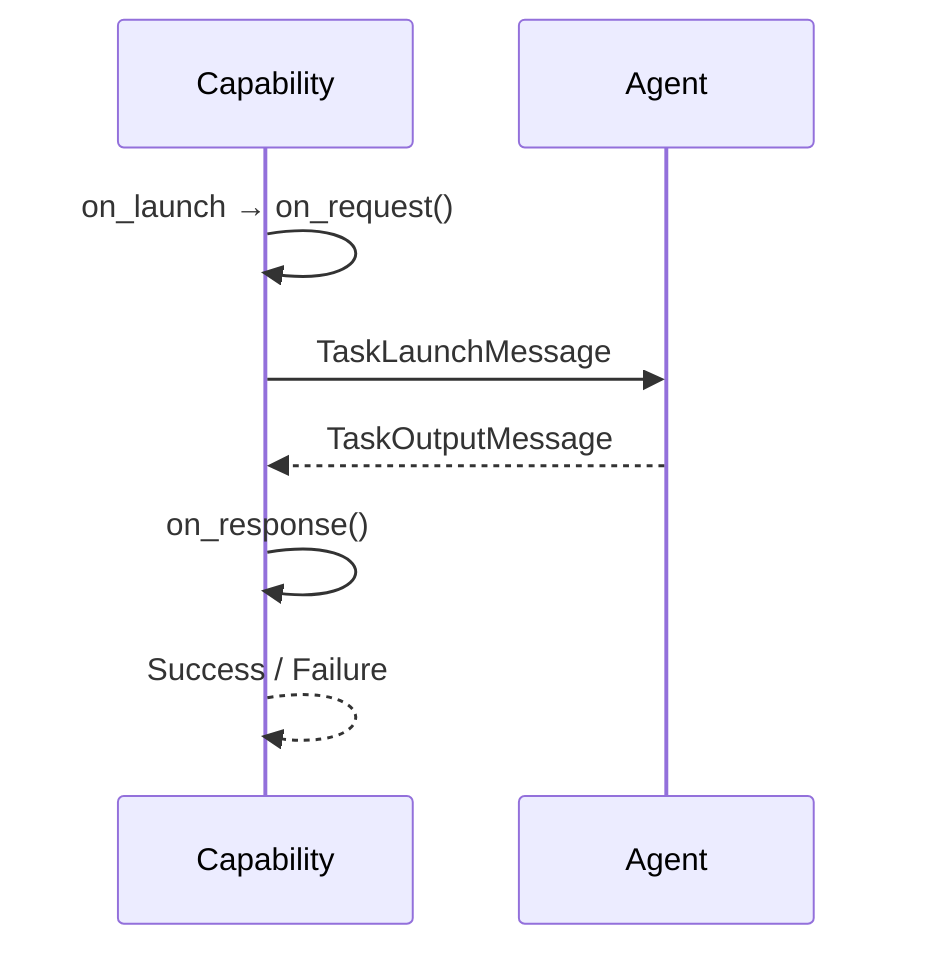

# Request-Response Capability

## Overview

`RequestResponseCapability` is the simplest exchange pattern in the framework:
send exactly one `TaskLaunchMessage` to the agent, and wait for exactly one
`TaskOutputMessage` back. It's the class-based equivalent of a plain synchronous
call, useful whenever a capability doesn't need multiple rounds or streaming:
just "ask the agent something, get an answer back."

Subclasses only override the hooks they need (`on_request`, `on_response`,
`on_timeout`, `resolve_timeout`); the actual send/receive machinery lives in
`on_launch` and `on_execute`, both marked `@final` so they can't be overridden.
If you set no timeout the capability waits forever for the one response.

## Communication Pattern

!!! info "Where this fits in"
    Every capability is driven by a shared `execute()` method: it calls
    `on_launch` to get a (possibly modified) `TaskLaunchMessage`, sends that
    message to the agent, then calls `on_execute` to await and process the
    response. The diagram below starts from that shared entry point.

This is the idiomatic path. Two things can branch off it:

!!! note "No response in time"
    If the agent doesn't respond within the timeout from `resolve_timeout`,
    `on_timeout(attempt)` is called instead of `on_response()`. Its return value
    decides what happens next:

    - Raising (the default) errors the task, so the timeout is visible in the task's
      event summary.
    - `None` waits again. This retries only the *receive*: nothing is resent (so no
      duplicate can reach an agent that never opted into de-duplicating one), and
      `resolve_timeout` is re-armed with an incremented `attempt`, so returning a
      growing value there gives progressive backoff.
    - A `Success`/`Failure` completes the task with that outcome.
    - `Finish` completes the task cleanly with no outcome. Note this is silent: the
      task is marked completed with no timeout signal.

    Because a receive-retry only ever re-waits, extending patience is always safe;
    what the framework never does on its own is resend.

!!! warning "Denying the launch"
    To deny a launch, raise `AgentCapabilityLaunchError` from `on_request`.
    `on_launch` enforces this: if `on_request` returns anything that isn't a
    `TaskLaunchMessage` (such as `None`), the launch is rejected and
    `AgentCapabilityLaunchError` is raised. Either way the task ends up
    **errored**, not skipped.

## Hooks

| Hook | Returns | Purpose |
|---|---|---|
| `resolve_timeout(task_launch_message, attempt)` | `int | float | None` | Seconds to wait for the response; `None` waits forever. Re-armed on every receive attempt: `attempt` is 0 for the first wait and increments per retry, so a growing value gives backoff. Always sees the original, unmutated launch message. |
| `on_request(task_launch_message)` | `TaskLaunchMessage` | Inspect or mutate the outgoing message before it's sent. Raise `AgentCapabilityLaunchError` to deny the launch (see warning above). |
| `on_response(task_output_message)` | `TaskOutputMessage` | Post-process the agent's response before it's wrapped into the outcome. |
| `on_timeout(attempt)` | `Success | Failure | Finish | None` | Decide what to do after the receive times out. Raising (the default) errors the task, surfacing the timeout; `None` waits again (retries the receive, re-arming `resolve_timeout` with an incremented `attempt`); `Success`/`Failure` reports that outcome; `Finish` finishes cleanly but silently. Never resends. |

!!! tip
    `resolve_timeout` always receives the original, unmutated launch message, even
    on retries, so a timeout that depends on message contents should be computed
    inside `resolve_timeout` itself rather than assumed from a mutation made later
    in `on_request`.
