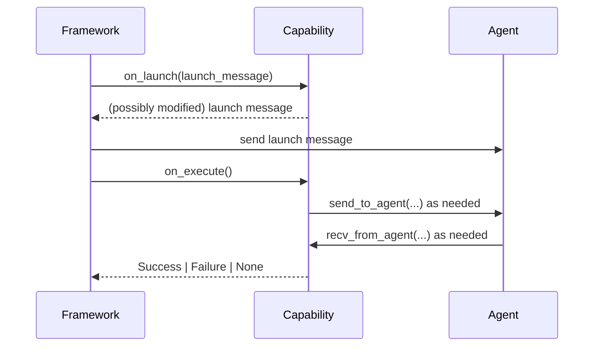
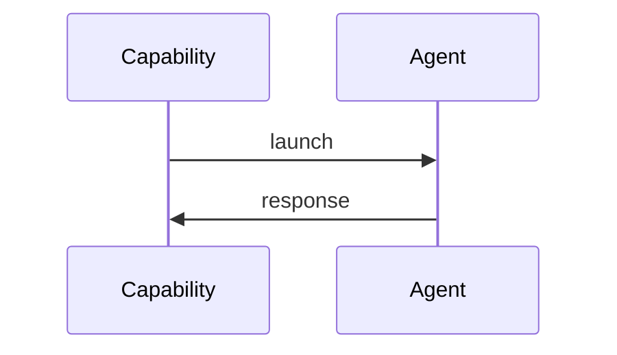
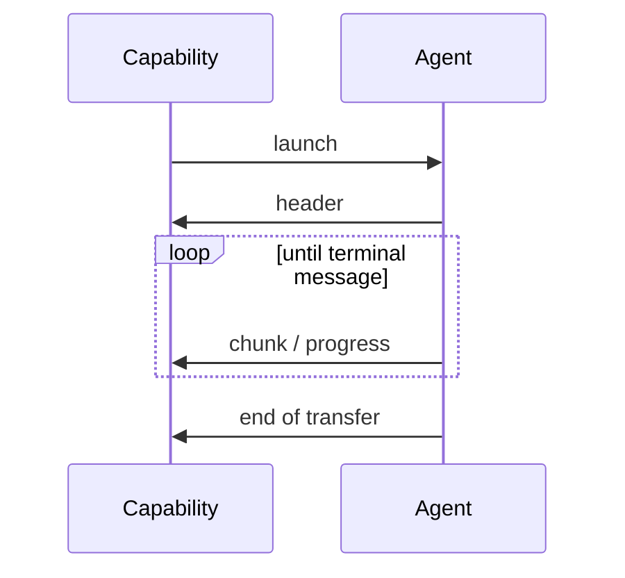
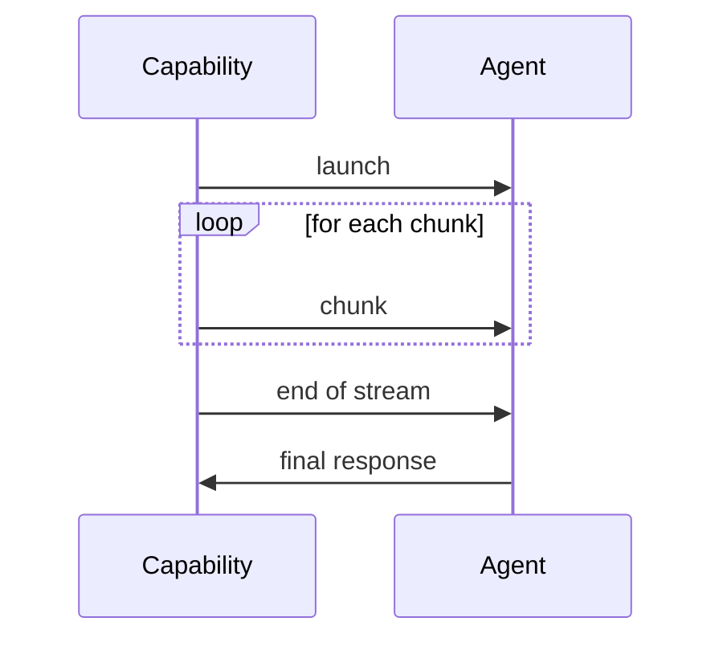
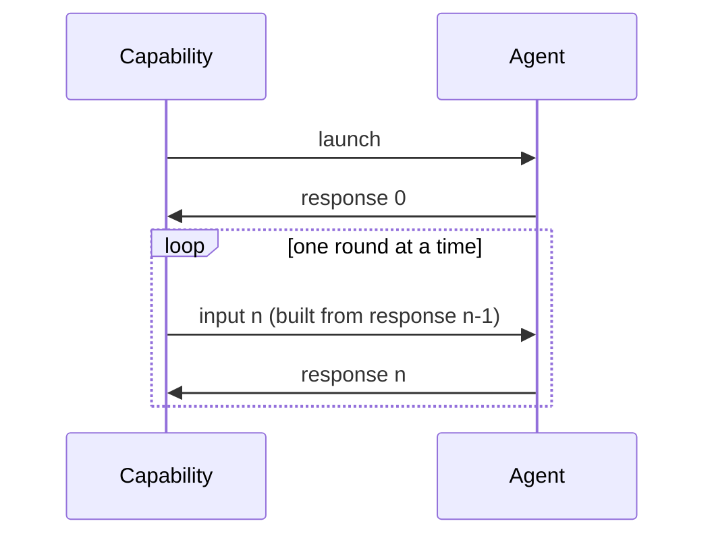
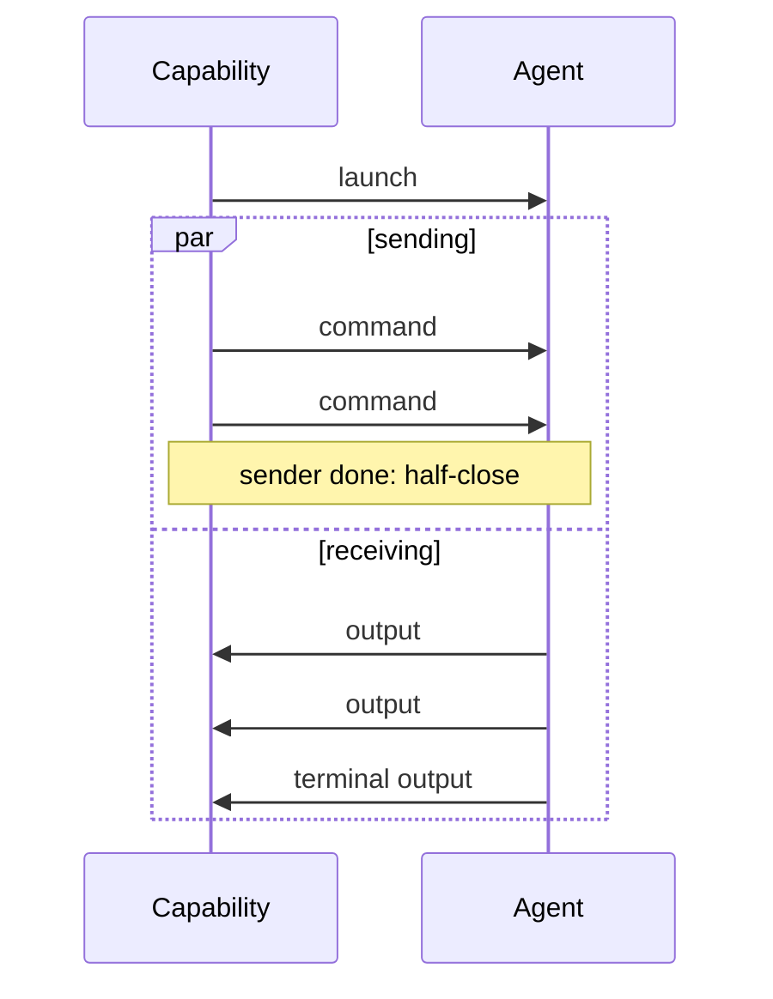

# Common agent capability patterns

This page is a cookbook. If you are thinking "I have a pattern X that I want to implement, what does X look like?", find the matching pattern below, copy the stripped-down recipe, and grow it from there.

Every recipe is a plain `on_execute` written against `BaseAgentCapability`. There are no template base classes to inherit from: the loop is yours, and the framework only provides the primitives (`send_to_agent`, `recv_from_agent`, the `emit_*` events) and two small opt-in helpers (`idle_attempts` and `duplex`).

!!! info "The rule of thumb"
    If you can read your `on_execute` top to bottom and see the whole exchange, you are doing it right. Reach for a helper only when the plain loop gets genuinely hard to write correctly.

## How a capability runs

Before the patterns, the calling convention. The framework drives every capability the same way:



1. `on_launch(task_launch_message)` runs first. Override it for pre-flight work: validate options, strip server-side arguments, enrich the message. Return the message to send, or raise `AgentCapabilityLaunchError` to deny the launch.
2. The framework sends the launch message to the agent.
3. `on_execute()` runs. This is where your pattern lives. Talk to the agent with `send_to_agent` and `recv_from_agent`, report progress with `update_progress` and the `emit_*` events.
4. Return an outcome.

| Return value | Meaning |
| --- | --- |
| `Success` | The task succeeded: an explicit terminal event is recorded. |
| `Failure` | The task failed: an explicit terminal event is recorded. |
| `None` | The task completed normally. Use this when everything worth reporting already went out via `emit_*` events. |
| raise | The task is errored. Uncaught exceptions, including `TimeoutError` from `recv_from_agent`, end up here. |

!!! tip "Launch versus input messages"
    The launch message is a handshake: it carries the command and arguments and is sent exactly once, by the framework. Inside `on_execute` you only ever build `TaskInputMessageModel` instances (or let `send_to_agent(data=...)` build them for you), so it is impossible to send a launch twice.

### Timeouts

`recv_from_agent(timeout=...)` raises `TimeoutError` when nothing arrives in time. Handle it inline like any other exception:

```python
try:
    response = await self.recv_from_agent(timeout=30)
except TimeoutError:
    return Failure(message="Agent did not respond within 30 seconds")
```

When you want to wait several times with growing patience, use the `idle_attempts` helper. It only does the schedule bookkeeping: the loop body stays yours.

```python
async for attempt in idle_attempts(timeouts=[5, 15, 60]):
    try:
        response = await self.recv_from_agent(timeout=attempt.timeout)
        break
    except TimeoutError:
        self.emit_info(f"Agent quiet after {attempt.elapsed:.0f}s, waiting longer")
else:
    return Failure(message="Agent never responded")
```

!!! warning "Retrying a receive never resends"
    Waiting again after a timeout only re-waits on the inbox. Nothing goes back over the wire, so no duplicate message can reach the agent. If you want to resend, do it explicitly with `send_to_agent`, and make sure the agent side can handle the duplicate.

## Pattern 1: Request-response

One message out, one message back. This is the default behavior of `BaseAgentCapability`, so the minimal version needs no `on_execute` at all.



Use it when the agent does one unit of work and reports once: run a command, query a value, take a snapshot.

```python
class Whoami(BaseAgentCapability):
    name = "whoami"
    description = "Return the current user on the agent."

    async def on_execute(self) -> Success | Failure | None:
        response = await self.recv_from_agent(timeout=30)
        response.message = response.message.strip()
        return response.to_outcome()
```

!!! info "The one-liner"
    The inherited default is `return (await self.recv_from_agent()).to_outcome()`. Only override `on_execute` when you need a timeout or want to post-process the response, as above.

## Pattern 2: Incoming stream

One launch, many responses. The agent streams messages back until it signals the end; your loop consumes them and decides when the exchange is over.



Use it when the agent produces output over time and you only listen: downloading a rendered file, tailing simulation progress, streaming log output.

```python
class DownloadFile(BaseAgentCapability):
    name = "download_file"
    description = "Download a single file from the agent."

    async def on_execute(self) -> Success | Failure | None:
        header = await self.recv_from_agent(timeout=30)
        if not header.success:
            return Failure(task_output_message=header)

        file_path = pathlib.Path(header.data["path"])
        file_size = header.data.get("size", 0)
        downloaded = 0

        while True:
            response = await self.recv_from_agent(timeout=60)
            if not response.success:
                return Failure(task_output_message=response)

            match response.data.get("type"):
                case "chunk":
                    downloaded += len(response.payload.data)
                    self.update_progress(
                        message=f"Downloading {file_path.name}",
                        percent_complete=downloaded / file_size * 100 if file_size else 0,
                    )
                case "end_of_file":
                    self.emit_artifact(message=f"Downloaded '{file_path.name}'")
                    return Success(message=f"Downloaded '{file_path.name}'")
                case unknown:
                    return Failure(message=f"Unknown message type: {unknown}")
```

The shape to copy: consume the header before the loop, then `recv` at the top of the loop and `match` on the message type. Sequence lives in code order, state lives in locals, and every way out of the exchange is a visible `return`.

!!! tip "Ephemeral versus recorded events"
    `update_progress` overwrites the task status and is safe to call per chunk. The `emit_*` events append to the task's event log, so save them for things worth keeping, like a finished artifact.

## Pattern 3: Outgoing stream

Many messages out, one final response. You stream input to the agent, stop, then wait for a single acknowledgement.



Use it when the agent consumes a stream and reports once at the end: uploading a file, feeding a dataset, submitting a batch of commands to run unattended.

```python
class UploadFile(BaseAgentCapability):
    name = "upload_file"
    description = "Upload a single file to the agent."

    async def on_execute(self) -> Success | Failure | None:
        source = pathlib.Path(self.task_launch_message.arguments["source"])
        chunk_size = 1_000_000

        with source.open("rb") as file:
            while chunk := file.read(chunk_size):
                await self.send_to_agent(
                    data={"type": "chunk"},
                    payload=chunk,
                )
        await self.send_to_agent(data={"type": "end_of_stream"})

        final = await self.recv_from_agent(timeout=60)
        return final.to_outcome()
```

"I am done sending" is just falling out of the loop. There is no sentinel to return and no half-close protocol to learn: send your terminal message, then receive.

!!! danger "Do not block the event loop"
    `file.read` above is fine for a recipe, but large reads on slow storage block the event loop. In real capabilities run blocking I/O through `asyncio.to_thread` or an async file library.

## Pattern 4: Lock-step stream

Strict turn taking: send one input, wait for its response, use that response to build the next input. Input and output stay paired one to one.



Use it when each step depends on the last: stepping a physics simulation and reading the state back, paging through results with a cursor, an interactive protocol where the agent's answer decides your next question.

```python
class StepSimulation(BaseAgentCapability):
    name = "step_simulation"
    description = "Step a physics simulation until it converges or hits the step cap."

    async def on_execute(self) -> Success | Failure | None:
        max_steps = self.task_launch_message.arguments.get("max_steps", 100)

        # Response to the launch: the initial simulation state.
        state = await self.recv_from_agent(timeout=30)
        if not state.success:
            return Failure(task_output_message=state)

        for step in range(max_steps):
            if state.data.get("converged"):
                return Success(message=f"Converged after {step} steps")

            # Build the next input from the previous response, then wait for
            # its paired reply before doing anything else.
            await self.send_to_agent(
                data={"action": "step", "dt": state.data["suggested_dt"]}
            )
            state = await self.recv_from_agent(timeout=30)
            if not state.success:
                return Failure(task_output_message=state)

            self.update_progress(
                message=f"Step {step + 1}/{max_steps}",
                percent_complete=(step + 1) / max_steps * 100,
            )

        return Failure(message=f"Did not converge within {max_steps} steps")
```

!!! warning "Never advance a round on a timeout"
    Lock step only works while sends and receives stay aligned. If a round's response times out, either keep waiting for that same response or stop the exchange. Skipping ahead and sending the next input desynchronizes the pairing, and there is no clean way back.

## Pattern 5: Bidirectional stream

Both directions flow at once: you send inputs while the agent streams outputs, with neither side waiting on the other. Termination follows a half-close model borrowed from gRPC: running out of things to send only closes the sending side, and the receiving side owns the end of the exchange.



Use it when the two directions are genuinely independent: streaming control commands while output streams back, live steering of a long-running render.

This is the one pattern where the plain-loop version is hard to get right: you need two concurrent tasks, correct cancellation on exit, and a send-side crash must not leave the receive side blocked forever. The `duplex` helper owns exactly that plumbing and nothing more. Your side of the exchange is an async generator of inputs plus an ordinary receive loop:

```python
class SteerRender(BaseAgentCapability):
    name = "steer_render"
    description = "Stream render commands while frames stream back."

    async def commands(self) -> AsyncIterator[TaskInputMessageModel]:
        for command in self.task_launch_message.arguments["commands"]:
            yield self.create_task_input_message(data={"command": command})
        # Falling off the end of the generator is the half-close: sending
        # stops, receiving continues below.

    async def on_execute(self) -> Success | Failure | None:
        async with duplex(self, outgoing=self.commands()) as incoming:
            async for frame in incoming:
                if not frame.success:
                    return Failure(task_output_message=frame)
                if frame.data.get("state") == "done":
                    return frame.to_outcome()
                self.update_progress(
                    message="Rendering",
                    percent_complete=frame.data.get("percent", 0),
                )
```

What `duplex` guarantees:

| Event | Behavior |
| --- | --- |
| `outgoing` generator ends | Half-close: sending stops, `incoming` keeps yielding. |
| `outgoing` generator raises | The exception surfaces inside your `async for` promptly, so a dead sender cannot leave you blocked on `recv`. |
| Your block exits (return, break, raise) | The send task is cancelled and awaited cleanly. The receive side owns termination. |

Inside the block you can also call `await incoming.recv(timeout=...)` directly instead of `async for` when you want per-message timeouts, and combine it with `idle_attempts` as shown earlier.

!!! tip "Reactive sending"
    An async generator cannot see incoming messages, which is fine for independent streams. If a received message must trigger a new send (for example the agent asks for a frame to be resent), bridge the two loops with an `asyncio.Queue`: the receive loop puts work on the queue, and the outgoing generator yields from it.

!!! info "Escape hatch"
    `duplex` is opt-in. If its half-close model does not fit, drop it and run your own `asyncio.TaskGroup` against `send_to_agent` and `recv_from_agent`. The primitives are always available.

## Choosing a pattern

| Pattern | Sends | Receives | Coupling | Typical use |
| --- | --- | --- | --- | --- |
| Request-response | 1 (launch) | 1 | none | Run a command, query a value |
| Incoming stream | 1 (launch) | many | none | Download, tail progress |
| Outgoing stream | many | 1 | none | Upload, feed a dataset |
| Lock-step stream | many | many | each input built from the previous response | Simulation stepping, cursor paging |
| Bidirectional stream | many | many | independent, half-close termination | Live steering, command streaming |

When in doubt start with the simplest pattern that could work and let the loop grow. Moving from request-response to an incoming stream is adding a `while` loop, not changing base classes.
