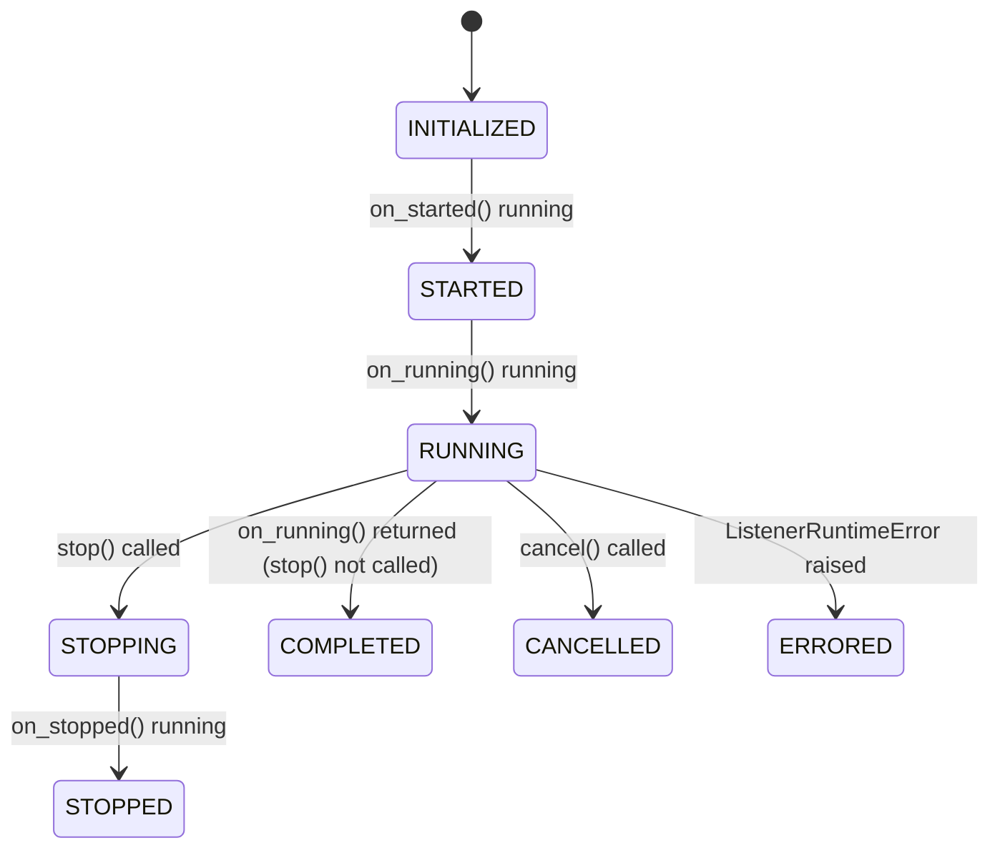

# Listeners Overview

A listener is a persistent, server-side network component that manages the full
lifecycle
of connected agents: accepting their initial registration, handing them tasks queued by
the operator, and receiving the results they submit. Listeners run as long-lived
background components alongside the server.

## Listener profiles

Every listener is defined as a **listener profile**: three cooperating classes that must
be written together and loaded as a unit.

| Class              | Base                   | Role                                                               |
|--------------------|------------------------|--------------------------------------------------------------------|
| `ListenerType`     | `BaseListenerType`     | Names the transport family; declares which agent types can connect |
| `ListenerTemplate` | `BaseListenerTemplate` | Configuration schema and factory; creates `Listener` instances     |
| `Listener`         | `BaseListener`         | The running network server; handles the agent wire protocol        |

The profile is declared by `ListenerTemplate`, which points at both the `Listener` class
it creates and the `ListenerType` that names the transport:

```python
class ListenerTemplate(BaseListenerTemplate):
    ...
    listener = Listener  # class to instantiate
    listener_type = ListenerType  # transport family tag
```

## How listener and agent profiles are linked

Agents are generated by agent profiles. An agent template declares a
`compatible_listener_types` set containing the `name` values of the listener types
it can connect through:

```python
# In an agent template:
compatible_listener_types = {"my_tcp_json"}


# In the listener type that agent connects to:
class ListenerType(BaseListenerType):
    name = "my_tcp_json"
```

When the framework builds an agent generator it checks that the listener type name
appears in the agent template's `compatible_listener_types`. Agent registration via
`connected_agents_service.register_agent()` resolves the agent type from either a
`payload_id` (the ID of a generated payload stored in the framework) or a raw
`agent_type` name.

## Project structure

Each listener profile lives in its own directory under
`consortium/components/listeners/`:

```
consortium/components/listeners/my_listener/
├── manifest.json
├── listener_type.py
├── listener_template.py
└── listener.py
```

`manifest.json` points the loader at the entry class and controls whether the profile
is loaded:

```json
{
  "entry_point": "listener_template:ListenerTemplate",
  "enabled": true
}
```

The entry point class must be named `ListenerTemplate` by convention.

## Listener lifecycle

A listener shares the same lifecycle state machine as plugins:



`self.status.state` holds the current state string. This covers the core runtime loop;
a couple of transitions are omitted from the diagram for clarity:

- Any state can transition to `FATAL` if an unhandled exception escapes a lifecycle
  hook.
- `COMPLETED`, `STOPPED`, `CANCELLED`, `ERRORED`, and `FATAL` are all terminal states
  that a listener can be restarted from, back to `INITIALIZED` or `STARTED`.

`ERRORED` and `FATAL` are the only states that carry an error; transitions into them
must supply a `ComponentRuntimeError`, and transitions into any other state must not.
Valid transitions are enforced by `Status._transition_to_state()` in
`consortium/framework/_components/_component_status.py`; any other transition raises
an `AssertionError`.

## The agent-listener protocol

A listener's `on_running()` method is responsible for implementing a network server
that speaks a protocol with agents. The framework imposes no constraints on the
transport (HTTP, raw TCP, DNS, etc.) but does require the listener to fulfill three
obligations via `self.connected_agents_service`:

1. **Registration**: accept an agent's initial check-in and call
   `connected_agents_service.register_agent()` to create an agent record.
2. **Task delivery**: respond to agents requesting pending task messages with the reader
   that matches the wire protocol, such as
   `connected_agents_service.get_next_task_message_sequential()`.
3. **Result submission**: accept agent task results and forward them via
   `connected_agents_service.dispatch_task_output_message()`.

Beyond these three, the rest of the protocol (framing, authentication, transport
encoding) is entirely up to the listener implementation.

## Real-world examples

`consortium/components/listeners/consortium/http/` is the canonical reference
implementation. It demonstrates:

- Socket availability check in `on_started` with `ListenerStartError`
- Spinning up an `aiohttp` web server in `on_running` with three route handlers
- Blocking on `await self.stop_event.wait()` inside `on_running`
- Tearing down the web runner in `on_stopped` and `on_cancelled`
- Using `self.connected_agents_service` for all three protocol obligations
- Handling both JSON-only and multipart (binary payload) result submissions
