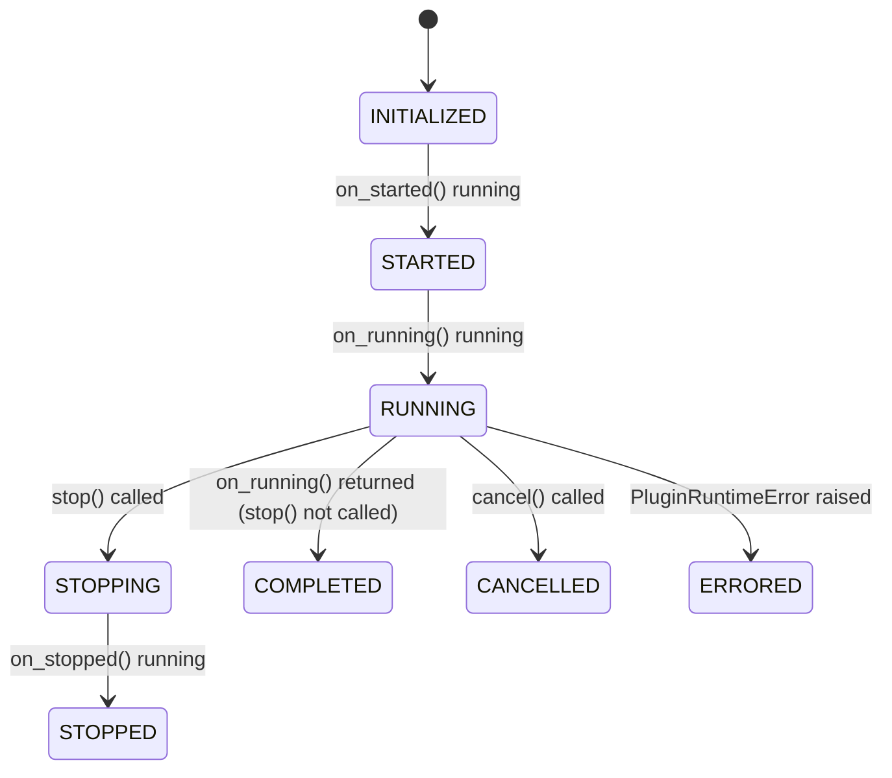

# Plugins Overview

A plugin is a persistent background component that runs continuously alongside the
Consortium server for the duration of its lifetime. Plugins are the right tool for tasks
that need to run independently of any specific agent, listener, or user action: polling
external services, scheduling periodic work, running integrations, or augmenting server
behavior.

## Plugins vs event hooks

| | Plugin | Event Hook |
|---|---|---|
| Execution model | Continuous async loop | Called on each matching event |
| Lifecycle | started, running, stopped, cancelled, errored, fatal | setup, triggered (N times), teardown |
| Use case | Periodic work, long-running integrations | Reacting to discrete framework events |

Use a plugin when your task needs its own background loop. Use an event hook when your
logic is a direct response to something the framework emitted.

## How plugins run

When the server starts, the framework instantiates each enabled plugin and calls
`start()`. The start sequence runs `on_started()` synchronously (blocking the start call),
then schedules `on_running()` as a concurrent asyncio Task. The plugin runs until the
server shuts down, at which point `stop()` is called.

```
start() called
  -> on_started()               awaited directly, blocks the start call
  -> asyncio.create_task(       returns immediately, runs concurrently
       on_running()
     )

stop() called
  -> on_stopped()               awaited directly, blocks the stop call
```

`on_running()` is where your main loop lives. Because it runs as a Task, it executes
concurrently with all other server activity. It must not block the event loop.

## autostart

`autostart = True` (the default) causes the framework to start the plugin automatically
when the server starts. `autostart = False` leaves the plugin registered but idle; it
must be started manually through the REST API.

```python
class Plugin(BasePlugin):
    ...
    autostart = True   # started with the server (default)
    autostart = False  # must be started manually via the API
```

## Project structure

Each plugin lives in its own directory under `consortium/components/plugins/`. The
directory must contain at minimum two files:

```
consortium/components/plugins/my_plugin/
├── manifest.json
└── plugin.py
```

`manifest.json` tells the framework where to find the plugin class and whether to load it:

```json
{
    "entry_point": "plugin:Plugin",
    "enabled": true
}
```

If your plugin has third-party Python dependencies, declare them in a `pyproject.toml`
alongside the manifest:

```toml
[project]
name = "consortium.my-plugin"
dependencies = [
    "aiohttp",
    "some-package>=1.0"
]
```

## Lifecycle states

A plugin moves through these states in order:



`self.status.state` holds the current state as a string. This covers the core runtime
loop; a couple of transitions are omitted from the diagram for clarity:

- Any state can transition to `FATAL` if an unhandled exception escapes a lifecycle
  hook.
- `COMPLETED`, `STOPPED`, `CANCELLED`, `ERRORED`, and `FATAL` are all terminal states
  that a listener can be restarted from, back to `INITIALIZED` or `STARTED`.

## Real-world examples

- `consortium/components/plugins/persistent_listeners/` restores previously running
  listeners on server restart by reading a JSON file in `on_started`, waiting on
  `stop_event` in `on_running`, and writing current listener state in `on_stopped`.

- `consortium/components/plugins/debug_console/` launches an interactive REPL in
  `on_started` and runs its prompt loop inside `on_running`, giving operators direct
  Python access to all framework services.

- `consortium/components/plugins/auto_updater/` performs a one-shot check in `on_running`
  and exits naturally (triggering `on_completed`), demonstrating plugins that do not
  need a persistent loop.
